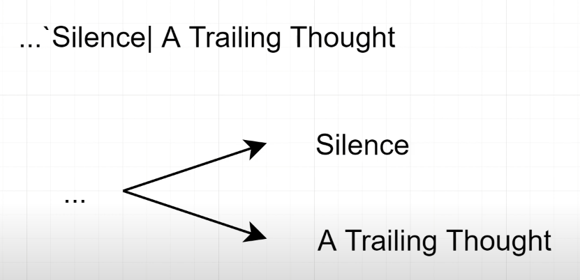
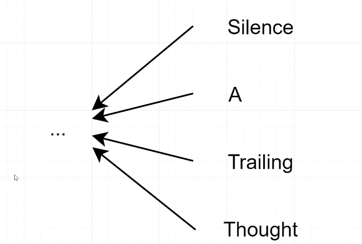

<div id="top"></div>
<!--
*** Thanks for checking out the Best-README-Template. If you have a suggestion
*** that would make this better, please fork the repo and create a pull request
*** or simply open an issue with the tag "enhancement".
*** Don't forget to give the project a star!
*** Thanks again! Now go create something AMAZING! :D
-->


<!-- PROJECT SHIELDS -->
<!--
*** I'm using markdown "reference style" links for readability.
*** Reference links are enclosed in brackets [ ] instead of parentheses ( ).
*** See the bottom of this document for the declaration of the reference variables
*** for contributors-url, forks-url, etc. This is an optional, concise syntax you may use.
*** https://www.markdownguide.org/basic-syntax/#reference-style-links
-->

[comment]: <> ([![Contributors][contributors-shield]][contributors-url])

[comment]: <> ([![Forks][forks-shield]][forks-url])

[comment]: <> ([![Stargazers][stars-shield]][stars-url])

[comment]: <> ([![Issues][issues-shield]][issues-url])

[comment]: <> ([![MIT License][license-shield]][license-url])

[comment]: <> ([![LinkedIn][linkedin-shield]][linkedin-url])


<!-- PROJECT LOGO -->
<br />
<div align="center">
  <a href="https://github.com/namworkmc/Project-A-star-Path-Finding">
    
  </a>

<h3 align="center">Java Dictionary Application</h3>

  <p align="center">
    Slang dictionary application project.
    <br />
    <br />
    <br />
  </p>
</div>


<!-- TABLE OF CONTENTS -->
<details>
  <summary>Table of Contents</summary>
  <ol>
    <li>
      <a href="#about-the-project">About The Project</a>
      <ul>
        <li><a href="#built-with">Built With</a></li>
      </ul>
    </li>
    <li>
      <a href="#getting-started">Getting Started</a>
      <ul>
        <li><a href="#prerequisites">Prerequisites</a></li>
        <li><a href="#installation">Installation</a></li>
      </ul>
    </li>
    <li><a href="#usage">Usage</a></li>
    <li><a href="#idea">Idea</a></li>
    <li><a href="#contact">Contact</a></li>
  </ol>
</details>


<!-- ABOUT THE PROJECT -->
<a id="about-the-project"></a>

## About The Project

[![Product Name Screen Shot][product-screenshot]](https://github.com/namworkmc/Java-Dictionary-Application/blob/main/images/img.png?raw=true)

Project slang dictionary application, uses Java Swing to create the GUI. Project's features include:

- Search slang's definitions
- Search definition to find slang words
- Modify slang and slang's definitions
- Game give slang words and guess the definition
- Game give definition and guess the slang word
- Show search history
- Random slang and definition everyday

<a id="built-with"></a>

### Built With

Used only Java core:

- Java 8
- Java Swing
- Java File
- Java Socket
- Java Collections
- Serializable

<!-- GETTING STARTED -->
<a id="getting-started"></a>

## Getting Started

Download the project from [GitHub](https://github.com/namworkmc/Java-Dictionary-Application) and run the project.
**Remember to install JDK, JRE and configure JAVA_HOME environment variable.**

<a id="prerequisites"></a>

### Prerequisites

[Install JDK, JRE and configure JAVA_HOME environment variable.](https://youtu.be/IJ-PJbvJBGs)

<a id="installation"></a>

### Installation and Usage

1. Clone the repo
   ```sh
   git clone https://github.com/namworkmc/Java-Dictionary-Application.git
   ```
2. Run the project with your IDE. I am using IntelliJ IDEA. Demo (with subtitles)
   ```sh
   https://www.youtube.com/watch?v=zktp0OE0qKQ
   ```

<!-- IDEA -->
<a id="idea"></a>

## Main Idea

Under the hood, the project uses Java Collections to store slang words and definitions.
More specifically, there are four Collections used: two **HashMap** and two **HashSet**:<br />
First **HashMap** is used to store slang words and first **HashSet** is used to store slang's definitions.<br />
Second **HashMap** is used to store definitions (word by word) and second **HashSet** is used to store definition's slang words.

Each slang's definition is stored in a **HashSet**, and each definition **HashSet** is stored in a **HashMap**
with the slang as the key. 


Each slang word is stored in a **HashSet**, 
and each slang **HashSet** is stored in a **HasMap** with definition word as the key.<br />


<!-- CONTACT -->
<a id="contact"></a>

## Contact

Nguyễn Đức Nam - [@Facebook](https://www.facebook.com/DucNamHCMUS) - namworkmc@gmail.com<br>

Project Link: [https://github.com/namworkmc/Java-Dictionary-Application](https://github.com/namworkmc/Java-Dictionary-Application)

<p align="right">(<a href="#top">back to top</a>)</p>


[contributors-shield]: https://img.shields.io/github/contributors/othneildrew/Best-README-Template.svg?style=for-the-badge

[contributors-url]: https://github.com/othneildrew/Best-README-Template/graphs/contributors

[forks-shield]: https://img.shields.io/github/forks/othneildrew/Best-README-Template.svg?style=for-the-badge

[forks-url]: https://github.com/othneildrew/Best-README-Template/network/members

[stars-shield]: https://img.shields.io/github/stars/othneildrew/Best-README-Template.svg?style=for-the-badge

[stars-url]: https://github.com/othneildrew/Best-README-Template/stargazers

[issues-shield]: https://img.shields.io/github/issues/othneildrew/Best-README-Template.svg?style=for-the-badge

[issues-url]: https://github.com/othneildrew/Best-README-Template/issues

[license-shield]: https://img.shields.io/github/license/othneildrew/Best-README-Template.svg?style=for-the-badge

[license-url]: https://github.com/othneildrew/Best-README-Template/blob/master/LICENSE.txt

[linkedin-shield]: https://img.shields.io/badge/-LinkedIn-black.svg?style=for-the-badge&logo=linkedin&colorB=555

[linkedin-url]: https://linkedin.com/in/othneildrew

[product-screenshot]: images/img.png
